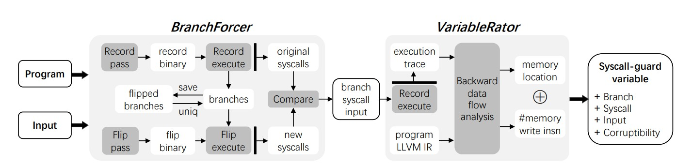

# VIPER: Spotting Syscall-Guard Variables for Data-Only Attacks

`VIPER` can automatically identify syscall-guard vairables for data-only attacks. It has two main components: 

* *BranchForcer* (built on [AFL](https://github.com/google/AFL)) shortlists candidates of syscall-guard branches;
* *VariableRator* measures the feasibility of corrupting syscall-guard variables.

<p align="left">

</p>

Please check [our paper](https://hengkai-ye.github.io/papers/security23-viper.pdf) published on USENIX Security 2023 for more details.

## Prerequisite

* `clang 6.0` - compiler  ([pre-built binaries](https://releases.llvm.org/download.html#6.0.1), [source code](https://github.com/llvm/llvm-project/tree/release/6.x))
* `graphviz` - data-flow visualizer ([source code](https://github.com/graphp/graphviz))
* `wllvm` - whole-program-llvm IR generator ([source code](https://github.com/travitch/whole-program-llvm))

## Build

```
./build.sh
```

## Test applications

* Check [test-sqlite.md](./test-sqlite.md) for steps to test SQLite.
* Check repository [viper-artifact](https://github.com/PSU-Security-Universe/viper-artifact) to test more programs

## End-to-end Attacks

* Check [data-only attacks](https://github.com/PSU-Security-Universe/data-only-attacks) for four new data-only attacks
  
## Authors

* Hengkai Ye hengkai@psu.edu
* Song Liu songliu@psu.edu
* Zhechang Zhang zbz5352@psu.edu
* Hong Hu honghu@psu.edu

## Publication

```bib
VIPER: Spotting Syscall-Guard Variables for Data-Only Attacks

@inproceedings{ye:viper,
  title        = {{VIPER: Spotting Syscall-Guard Variables for Data-Only Attacks}},
  author       = {Hengkai Ye and Song Liu and Zhechang Zhang and Hong Hu},
  booktitle    = {Proceedings of the 32nd USENIX Security Symposium (USENIX 2023)},
  month        = {aug},
  year         = {2023},
  address      = {Anaheim, CA},
}
```

## Support

We thank National Science Foundation (NSF) for supporting our work.
This research is supported by NSF under grant CNS-2247652.
